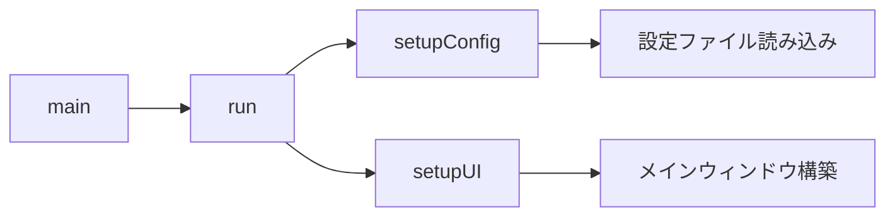
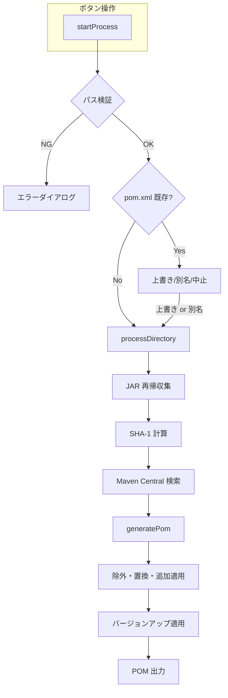
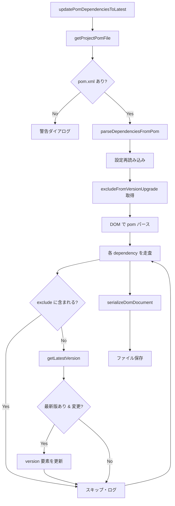
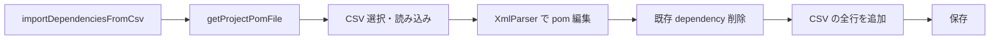
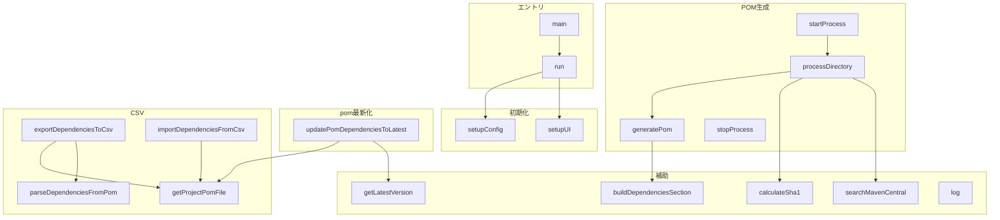

# AntToMavenTool メソッド一覧

`AntToMavenConverter.groovy`（クラス `AntToMavenTool`）のメソッド名と処理概要をまとめたドキュメントです。

---

## エントリポイント

| メソッド | 処理概要 |
|----------|----------|
| `main(String[] args)` | アプリケーションのエントリポイント。`AntToMavenTool` をインスタンス化して `run()` を呼び出す。 |
| `run()` | 起動処理。設定の読み込み（`setupConfig`）と UI 構築（`setupUI`）を実行する。 |

---

## 初期化・設定

| メソッド | 処理概要 |
|----------|----------|
| `setupConfig()` | 設定ファイルを読み込む。`~/.ant-to-maven-converter/ant-to-maven-default.groovy` が無ければ JAR 同梱のリソースをコピーして作成し、ConfigSlurper でパースして `config` に格納する。 |
| `setupUI()` | Swing でメインウィンドウを構築する。プロジェクトパス・設定ファイルパスのコンボ、最新版チェック、POM生成／中止ボタン、ログエリア、進捗バー、CSV エクスポート／インポートボタンなどを配置する。 |

---

## POM 生成フロー（メイン処理）

| メソッド | 処理概要 |
|----------|----------|
| `startProcess()` | 「POM生成」ボタン押下時の処理。パス検証、既存 pom.xml の上書き確認（上書きする／別名で保存／処理中止）、設定の再読み込み、履歴保存のあと、バックグラウンドで `processDirectory` を実行する。 |
| `stopProcess()` | 「中止」ボタン押下時。`isRunning` を false にし、処理の停止を要求する（現在の処理の完了を待つ）。 |
| `processDirectory(File projectDir, File outputPomFile)` | プロジェクト配下の JAR を再帰的に収集し、各 JAR の SHA-1 を計算して Maven Central API で検索。見つかったものは `Dependency` として、見つからないものは system スコープで `scannedDeps` に追加。最後に `generatePom` を呼び出す。 |
| `generatePom(File projectDir, List<Dependency> scannedDependencies, File outputPomFile)` | スキャン結果に設定の除外・置換・追加を適用して `finalDependencies` を組み立て、オプションでバージョンアップを適用。設定の `pomProjectTemplate` があれば `{{DEPENDENCIES}}` を差し替え、なければ標準の project 構造で pom.xml を生成してファイルに書き出す。 |

---

## pom.xml 依存関係最新化

| メソッド | 処理概要 |
|----------|----------|
| `updatePomDependenciesToLatest()` | 「pom.xml 依存関係最新化」ボタン押下時。設定を再読み込みし、DOM で pom.xml をパース。各 `<dependency>` について `excludeFromVersionUpgrade` に含まれる場合はスキップ、そうでなければ `getLatestVersion` で最新版を取得して `<version>` のみ更新。コメントは DOM で保持。 |

---

## UI 補助（フォルダ・履歴）

| メソッド | 処理概要 |
|----------|----------|
| `openConfigFolder()` | 設定ファイルのパスから親フォルダを取得し、エクスプローラで開く。 |
| `saveConfigPathHistory(String path)` | 設定ファイルパスをコンボの履歴に追加し、Preferences に永続化する。 |
| `openProjectFolder()` | 選択中のプロジェクトルートパスのフォルダをエクスプローラで開く。 |
| `openFolder(File folder, String dialogTitle)` | 指定フォルダを `Desktop.getDesktop().open()` で開く。失敗時はエラーダイアログを表示する。 |
| `saveHistory(String path)` | プロジェクトルートパスをコンボの履歴に追加し、Preferences に永続化する。 |

---

## CSV エクスポート・インポート

| メソッド | 処理概要 |
|----------|----------|
| `getProjectPomFile()` | コンボで選択中のプロジェクトパス配下の `pom.xml` を返す。無効な場合は null。 |
| `parseDependenciesFromPom(File pomFile)` | pom.xml を XmlSlurper でパースし、`<dependency>` の groupId / artifactId / version / scope を取得して `List<Dependency>` で返す。 |
| `exportDependenciesToCsv()` | 選択プロジェクトの pom.xml から依存関係をパースし、ファイル保存ダイアログで指定した CSV に `groupId,artifactId,version,scope` 形式でエクスポートする。 |
| `importDependenciesFromCsv()` | CSV を選択して読み込み、既存 pom.xml の `<dependencies>` 内の全 dependency を削除したうえで、CSV の全行を新規 dependency として追加し、pom.xml を上書き保存する。 |

---

## POM 出力・Maven API まわり

| メソッド | 処理概要 |
|----------|----------|
| `buildDependenciesSection(MarkupBuilder builder, List<Dependency> finalDependencies, List<String> excludedKeys)` | MarkupBuilder に `<dependencies>` ブロックを出力する。除外された key をコメントで列挙し、各 Dependency の dependencyComment / versionComment / scope / systemPath / classifier を反映する。 |
| `calculateSha1(File file)` | ファイルの SHA-1 ハッシュを計算して 16 進文字列で返す。 |
| `searchMavenCentral(String sha1)` | Maven Central Search API に SHA-1 でクエリし、一致したアーティファクトの groupId / artifactId / version を `[g, a, v]` 形式で返す。見つからなければ null。 |
| `getLatestVersion(String groupId, String artifactId)` | Maven Central API で groupId:artifactId の最新バージョンを検索し、バージョン文字列を返す。取得できない場合は null。 |
| `getRelativePath(File base, File file)` | `base` から `file` への相対パスを URI で計算して返す。 |
| `updateProgress(int current, int max, String message)` | 進捗バーの maximum / value / string を EDT 上で更新する。 |
| `log(String message)` | ログエリアにメッセージを追記し、キャレットを末尾に移動する（EDT で実行）。 |

---

## 内部クラス

| クラス・メソッド | 処理概要 |
|------------------|----------|
| `Dependency`（static 内部クラス） | 依存関係を表すデータクラス。groupId, artifactId, version, scope, classifier, systemPath, originalFile, dependencyComment, versionComment を保持する。 |
| `Dependency.toString()` | `"groupId:artifactId:version"` 形式の文字列を返す。 |

---

## 処理の流れ（Mermaid 図）

### 起動フロー

### POM 生成フロー

### pom.xml 依存関係最新化フロー

### CSV エクスポート

### CSV インポート

### メソッド分類（ブロック図）

---

## 処理の流れ（概要・テキスト）

1. **起動** … `main` → `run` → `setupConfig` → `setupUI`
2. **POM 生成** … `startProcess` →（上書き確認）→ `processDirectory`（JAR スキャン・Maven 検索）→ `generatePom`（除外・置換・追加 → バージョンアップ → POM 出力）
3. **pom.xml 依存関係最新化** … `updatePomDependenciesToLatest` → 設定再読み込み → DOM パース → 各 dependency で exclude 判定／`getLatestVersion` → 更新分のみシリアライズ・保存
4. **CSV エクスポート** … `exportDependenciesToCsv` → `getProjectPomFile` → `parseDependenciesFromPom` → ファイル保存
5. **CSV インポート** … `importDependenciesFromCsv` → `getProjectPomFile` → CSV 読み込み → XmlParser で pom 編集 → 保存
