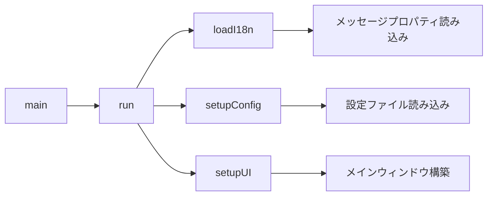
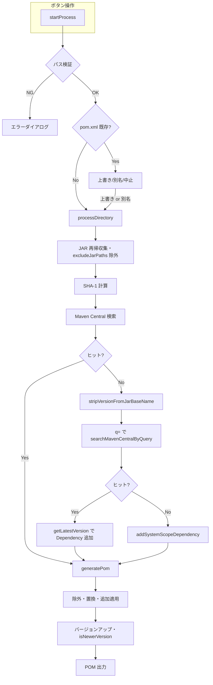
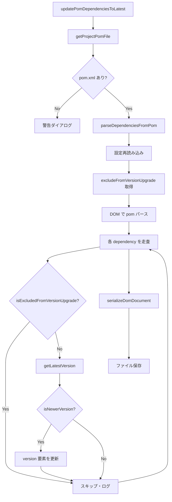
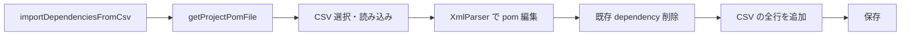

# AntToMavenTool メソッド一覧

`src/main/groovy/AntToMavenConverter.groovy` に定義されているクラス `AntToMavenTool` のメソッド名と処理概要をまとめたドキュメントです。

---

## エントリポイント

| メソッド | 処理概要 |
|----------|----------|
| `main(String[] args)` | アプリケーションのエントリポイント。`AntToMavenTool` をインスタンス化して `run()` を呼び出す。 |
| `run()` | 起動処理。保存済み言語で `loadI18n`、設定の読み込み（`setupConfig`）、UI 構築（`setupUI`）を実行する。 |

---

## 初期化・設定

| メソッド | 処理概要 |
|----------|----------|
| `setupConfig()` | 設定ファイルを読み込む。デフォルト配置先は `getDefaultConfigDirectory()`（JAR 実行時は JAR と同じフォルダ、IDE 実行時はクラスパス直下、それ以外は `~/.ant-to-maven-converter/`）。該当パスにファイルが無ければ JAR 同梱のリソースをコピーして作成し、ConfigSlurper でパースして `config` に格納する。 |
| `setupUI()` | Swing でメインウィンドウを構築する。プロジェクトパス・設定ファイルパスのコンボは `readProjectPathHistory()` / `readConfigPathHistory()` で `~/.ant-to-maven-converter/` 内のテキストファイルから読み込む。設定ファイルコンボ横の「参照」ボタンで `browseConfigFile()` を呼び出しファイル選択ダイアログでパスを指定する。言語コンボ、最新版チェック、POM生成／中止／pom 依存最新化、ログエリア、進捗バー、CSV エクスポート／インポートボタンなどを配置する。 |

---

## 設定・履歴パス（static ヘルパー）

| メソッド | 処理概要 |
|----------|----------|
| `getJarDirectory()` | JAR 実行時のみ、JAR ファイルの親ディレクトリを返す。IDE 実行時や取得失敗時は null。 |
| `getDefaultConfigDirectory()` | デフォルトの設定ファイル配置ディレクトリ。JAR 実行時は `getJarDirectory()`、IDE 実行時はクラスパス上の `ant-to-maven-default.groovy` の親ディレクトリ、それ以外は `~/.ant-to-maven-converter/`。 |
| `getDefaultConfigPath()` | デフォルトの設定ファイルの絶対パス（`getDefaultConfigDirectory()` + `ant-to-maven-default.groovy`）。 |
| `getHistoryDir()` | 履歴保存用ディレクトリ（`~/.ant-to-maven-converter/`）。保存時に存在しなければ作成する。 |
| `readProjectPathHistory()` | `~/.ant-to-maven-converter/project-history.txt` を UTF-8 で読み、1 行 1 パスでリストを返す。ファイルが無い場合は空リスト。 |
| `saveProjectPathHistory(List<String> items)` | プロジェクトフォルダ履歴を `project-history.txt` に 1 行 1 パス（UTF-8）で保存する。 |
| `readConfigPathHistory(String defaultPath)` | `~/.ant-to-maven-converter/config-history.txt` を読み、1 行 1 パスでリストを返す。ファイルが無いか空の場合は `[defaultPath]`。 |
| `saveConfigPathHistoryToFile(List<String> items)` | 設定ファイルパス履歴を `config-history.txt` に 1 行 1 パス（UTF-8）で保存する。 |

---

## i18n・UI 文言

| メソッド | 処理概要 |
|----------|----------|
| `loadI18n(String lang)` | 指定ロケール（`ja` / `en`）のメッセージプロパティ（`messages_ja.properties` / `messages_en.properties`）を UTF-8 で読み込み、`i18nMessages` に格納する。 |
| `refreshUIStrings()` | 言語切り替え時に、メインウィンドウ・ラベル・ボタン・チェックボックスなどの表示文言を `i18n` で再適用する。 |
| `i18n(String key)` | メッセージキーに対応する文言を返す。 |
| `i18n(String key, Object... args)` | メッセージキーに対応するテンプレートに `MessageFormat.format` で引数を埋め込んで返す。 |

---

## POM 生成フロー（メイン処理）

| メソッド | 処理概要 |
|----------|----------|
| `startProcess()` | 「POM生成」ボタン押下時の処理。パス検証、既存 pom.xml の上書き確認（上書きする／別名で保存／処理中止）、設定の再読み込み、履歴保存のあと、バックグラウンドで `processDirectory` を実行する。 |
| `stopProcess()` | 「中止」ボタン押下時。`isRunning` を false にし、処理の停止を要求する（現在の処理の完了を待つ）。 |
| `processDirectory(File projectDir, File outputPomFile)` | プロジェクト配下の JAR を再帰的に収集（`excludeJarPaths` の glob で除外）。各 JAR の SHA-1 を `calculateSha1` で計算し、`searchMavenCentral(sha1)` で検索。ヒットすれば `Dependency` に追加。見つからない場合は JAR ベース名（拡張子・バージョン番号なし）を `stripVersionFromJarBaseName` で取得し、**`a:` 検索は行わず** `searchMavenCentralByQuery(nameForSearch)` で `q=` 一般検索のみ行う。ヒットすれば最新版を取得して追加、それでも見つからなければ `addSystemScopeDependency` で system スコープの依存を追加。最後に `generatePom` を呼び出す。 |
| `generatePom(File projectDir, List<Dependency> scannedDependencies, File outputPomFile)` | スキャン結果に設定の除外・置換・追加を適用して `finalDependencies` を組み立て、オプションで `getLatestVersion(groupId, artifactId, currentVersion)` によるバージョンアップを適用（同一メジャー内・プレリリース除外。`isNewerVersion` でダウングレード防止）。設定の `pomProjectTemplate` があれば `{{DEPENDENCIES}}` を差し替え、なければ標準の project 構造で pom.xml を生成してファイルに書き出す。 |

---

## pom.xml 依存関係最新化

| メソッド | 処理概要 |
|----------|----------|
| `updatePomDependenciesToLatest()` | 「pom.xml 依存関係最新化」ボタン押下時。設定を再読み込みし、`DocumentBuilder`（コメント保持）で pom.xml をパース。各 `<dependency>` について `isExcludedFromVersionUpgrade` で対象外ならスキップ、そうでなければ `getLatestVersion(g, a, currentVer)` で同一メジャー・プレリリース除外後の最新版を取得し、`isNewerVersion` で現行より新しい場合のみ `<version>` を更新。最後に `serializeDomDocument` で XML を書き出して保存。 |

---

## UI 補助（フォルダ・履歴）

| メソッド | 処理概要 |
|----------|----------|
| `browseConfigFile()` | 設定ファイル用のファイル選択ダイアログ（JFileChooser）を表示し、選択したファイルのパスをコンボに表示して履歴に追加する。 |
| `saveConfigPathHistory(String path)` | 設定ファイルパスをコンボの履歴に追加し、`~/.ant-to-maven-converter/config-history.txt` に 1 行 1 パス（UTF-8）で保存する。 |
| `openProjectFolder()` | 選択中のプロジェクトルートパスのフォルダをエクスプローラで開く。 |
| `openFolder(File folder, String dialogTitle)` | 指定フォルダを `Desktop.getDesktop().open()` で開く。失敗時はエラーダイアログを表示する。 |
| `saveHistory(String path)` | プロジェクトルートパスをコンボの履歴に追加し、`~/.ant-to-maven-converter/project-history.txt` に 1 行 1 パス（UTF-8）で保存する。 |

---

## CSV エクスポート・インポート

| メソッド | 処理概要 |
|----------|----------|
| `getProjectPomFile()` | コンボで選択中のプロジェクトパス配下の `pom.xml` を返す。無効な場合は null。 |
| `parseDependenciesFromPom(File pomFile)` | pom.xml を XmlSlurper でパースし、`<dependency>` の groupId / artifactId / version / scope を取得して `List<Dependency>` で返す。 |
| `exportDependenciesToCsv()` | 選択プロジェクトの pom.xml から依存関係をパースし、ファイル保存ダイアログで指定した CSV に `groupId,artifactId,version,scope` 形式でエクスポートする。 |
| `importDependenciesFromCsv()` | CSV を選択して読み込み、既存 pom.xml の `<dependencies>` 内の全 dependency を削除したうえで、CSV の全行を新規 dependency として追加し、pom.xml を上書き保存する。 |

---

## JAR フォールバック・検索

| メソッド | 処理概要 |
|----------|----------|
| `stripVersionFromJarBaseName(String baseName)` | JAR のベース名（拡張子除く）から末尾のバージョン部分を除去する。例: `primefaces-15.0.5` → `primefaces`。正規表現で `-数字(.数字)*(-qualifier)?` 形式を削除。 |
| `searchMavenCentralByArtifactId(String artifactId)` | Maven Central Search API を `a:"artifactId"` で検索し、最初にヒットした `[g, a]` を返す。（現在の POM 生成フローでは未使用。SHA-1 未ヒット時は `searchMavenCentralByQuery` のみ使用。） |
| `searchMavenCentralByQuery(String query)` | 一般クエリ `q=` で Maven Central を検索し、最初にヒットした `[g, a]` を返す。SHA-1 で見つからない場合、JAR ファイル名（拡張子・バージョン番号なし）でこの検索のみをフォールバックとして行う。 |
| `addSystemScopeDependency(File projectDir, File jar, List<Dependency> scannedDeps)` | SHA-1 および名前検索でも見つからなかった JAR を、`groupId: local.dependency`、`system` スコープ、`systemPath` に `\${project.basedir}/相対パス` を設定して `scannedDeps` に追加する。 |

---

## DOM・バージョン比較（pom 更新用）

| メソッド | 処理概要 |
|----------|----------|
| `isExcludedFromVersionUpgrade(String key, Collection excludeFromVersionUpgrade)` | 設定の `excludeFromVersionUpgrade` に `groupId:artifactId` が含まれるか判定。文字列または Map（`key` または `groupId`/`artifactId`）に対応。対象外なら true。 |
| `getFirstChildElement(Element parent, String tagName)` | DOM の `Element` から、指定タグ名の直下の最初の子要素を返す。無ければ null。 |
| `getFirstChildElementText(Element parent, String tagName)` | 上記で取得した子要素のテキスト内容を返す。 |
| `serializeDomDocument(Document doc)` | DOM Document を XML 文字列にシリアライズする。コメント・構造を保持。連続空行は 1 行にまとめる。 |
| `isNewerVersion(String newVersion, String currentVersion)` | `ComparableVersion` で比較し、`newVersion` が `currentVersion` より新しい場合のみ true。バージョンダウン防止に使用。 |

---

## POM 出力・Maven API まわり

| メソッド | 処理概要 |
|----------|----------|
| `buildDependenciesSection(MarkupBuilder builder, List<Dependency> finalDependencies, List<String> excludedKeys)` | MarkupBuilder に `<dependencies>` ブロックを出力する。除外された key をコメントで列挙し、各 Dependency の dependencyComment / versionComment / scope / systemPath / classifier を反映する。 |
| `calculateSha1(File file)` | ファイルの SHA-1 ハッシュを計算して 16 進文字列で返す。 |
| `searchMavenCentral(String sha1)` | Maven Central Search API に SHA-1 でクエリし、一致したアーティファクトの groupId / artifactId / version を `[g, a, v]` 形式で返す。見つからなければ null。 |
| `getLatestVersion(String groupId, String artifactId, String currentVersion)` | Maven Central の **maven-metadata.xml** を取得し、`<versions>` 一覧から **プレリリース除外**（`isPreReleaseVersion` / 設定の `preReleaseVersionPatterns`）および **同一メジャー**（`currentVersion` 指定時は `getMajorVersion` で同じメジャーのみ）に絞ったうえで最大バージョンを返す。取得できない場合は null。 |
| `isPreReleaseVersion(String version, List<String> patterns)` | バージョン文字列がプレリリースかどうか判定。`patterns` 未指定時はデフォルト（alpha, beta, -rc, .rc, snapshot, milestone, preview）を使用。大文字小文字無視。 |
| `getMajorVersion(String version)` | バージョン文字列からメジャーバージョン（先頭の数値）を取得。取得できない場合は null。 |
| `getRelativePath(File base, File file)` | `base` から `file` への相対パスを URI で計算して返す。 |
| `updateProgress(int current, int max, String message)` | 進捗バーの maximum / value / string を EDT 上で更新する。 |
| `log(String message)` | ログエリアにメッセージを追記し、キャレットを末尾に移動する（EDT で実行）。 |

---

## 内部クラス

| クラス・メソッド | 処理概要 |
|------------------|----------|
| `Dependency`（static 内部クラス） | 依存関係を表すデータクラス。groupId, artifactId, version, scope, classifier, systemPath, originalFile, dependencyComment, versionComment を保持する。 |
| `Dependency.toString()` | `"groupId:artifactId:version"` 形式の文字列を返す。 |

---

## 処理の流れ（Mermaid 図）

### 起動フロー

```mermaid
flowchart LR
    A[main] --> B[run]
    B --> C[loadI18n]
    B --> D[setupConfig]
    B --> E[setupUI]
    C --> C1[メッセージプロパティ読み込み]
    D --> D1[設定ファイル読み込み]
    E --> E1[メインウィンドウ構築]
```

### POM 生成フロー

```mermaid
flowchart TB
    subgraph ボタン操作
        S[startProcess]
    end
    S --> V{パス検証}
    V -->|NG| E[エラーダイアログ]
    V -->|OK| W{pom.xml 既存?}
    W -->|Yes| O[上書き/別名/中止]
    W -->|No| P[processDirectory]
    O -->|上書き or 別名| P
    P --> P1[JAR 再帰収集・excludeJarPaths 除外]
    P1 --> P2[SHA-1 計算]
    P2 --> P3[Maven Central 検索]
    P3 --> P3b{ヒット?}
    P3b -->|No| P3c[stripVersionFromJarBaseName]
    P3c --> P3d[q= で searchMavenCentralByQuery]
    P3d --> P3e{ヒット?}
    P3e -->|Yes| P3f[getLatestVersion で Dependency 追加]
    P3e -->|No| P3g[addSystemScopeDependency]
    P3b -->|Yes| P4[generatePom]
    P3f --> P4
    P3g --> P4
    P4 --> G1[除外・置換・追加適用]
    G1 --> G2[バージョンアップ・isNewerVersion]
    G2 --> G3[POM 出力]
```

### pom.xml 依存関係最新化フロー

```mermaid
flowchart TB
    U[updatePomDependenciesToLatest] --> U1[getProjectPomFile]
    U1 --> U2{pom.xml あり?}
    U2 -->|No| U3[警告ダイアログ]
    U2 -->|Yes| U4[parseDependenciesFromPom]
    U4 --> U5[設定再読み込み]
    U5 --> U6[excludeFromVersionUpgrade 取得]
    U6 --> U7[DOM で pom パース]
    U7 --> U8[各 dependency を走査]
    U8 --> U9{isExcludedFromVersionUpgrade?}
    U9 -->|Yes| U10[スキップ・ログ]
    U9 -->|No| U11[getLatestVersion]
    U11 --> U12{isNewerVersion?}
    U12 -->|Yes| U13[version 要素を更新]
    U12 -->|No| U10
    U13 --> U10
    U10 --> U8
    U8 --> U14[serializeDomDocument]
    U14 --> U15[ファイル保存]
```

### CSV エクスポート

```mermaid
flowchart LR
    E1[exportDependenciesToCsv] --> E2[getProjectPomFile]
    E2 --> E3[parseDependenciesFromPom]
    E3 --> E4[保存ダイアログ]
    E4 --> E5[CSV 書き出し]
```

### CSV インポート

```mermaid
flowchart LR
    I1[importDependenciesFromCsv] --> I2[getProjectPomFile]
    I2 --> I3[CSV 選択・読み込み]
    I3 --> I4[XmlParser で pom 編集]
    I4 --> I5[既存 dependency 削除]
    I5 --> I6[CSV の全行を追加]
    I6 --> I7[保存]
```

### メソッド分類（ブロック図）

```mermaid
flowchart TB
    subgraph エントリ
        M[main]
        R[run]
    end
    subgraph 初期化
        LI[loadI18n]
        SC[setupConfig]
        SU[setupUI]
    end
    subgraph POM生成
        SP[startProcess]
        PD[processDirectory]
        GP[generatePom]
        ST[stopProcess]
    end
    subgraph pom最新化
        UP[updatePomDependenciesToLatest]
    end
    subgraph CSV
        EX[exportDependenciesToCsv]
        IM[importDependenciesFromCsv]
        GPP[getProjectPomFile]
        PR[parseDependenciesFromPom]
    end
    subgraph 補助・API
        BDS[buildDependenciesSection]
        SHA[calculateSha1]
        MC[searchMavenCentral]
        MCQ[searchMavenCentralByQuery]
        GLV[getLatestVersion]
        IS_PRE[isPreReleaseVersion]
        MAJOR[getMajorVersion]
        STRIP[stripVersionFromJarBaseName]
        ADD_SYS[addSystemScopeDependency]
        LOG[log]
    end
    subgraph 設定・履歴
        JAR_DIR[getJarDirectory]
        DEFAULT_CFG[getDefaultConfigDirectory]
        READ_PROJ[readProjectPathHistory]
        READ_CFG[readConfigPathHistory]
        SAVE_PROJ[saveProjectPathHistory]
        SAVE_CFG[saveConfigPathHistoryToFile]
    end
    subgraph DOM・バージョン
        IS_EX[isExcludedFromVersionUpgrade]
        SER[serializeDomDocument]
        IS_NEW[isNewerVersion]
    end
    M --> R
    R --> LI
    R --> SC
    R --> SU
    SC --> DEFAULT_CFG
    SU --> READ_PROJ
    SU --> READ_CFG
    SP --> PD
    PD --> GP
    EX --> GPP
    EX --> PR
    IM --> GPP
    UP --> GPP
    GP --> BDS
    PD --> SHA
    PD --> MC
    PD --> STRIP
    PD --> MCQ
    PD --> ADD_SYS
    UP --> GLV
    UP --> IS_EX
    UP --> SER
    UP --> IS_NEW
```

---

## 処理の流れ（概要・テキスト）

1. **起動** … `main` → `run` → `loadI18n` / `setupConfig` / `setupUI`
2. **POM 生成** … `startProcess` →（上書き確認）→ `processDirectory`（JAR 収集・excludeJarPaths 除外 → SHA-1 → `searchMavenCentral`、未ヒット時は `stripVersionFromJarBaseName` + `searchMavenCentralByQuery`（`q=` のみ）または `addSystemScopeDependency`）→ `generatePom`（除外・置換・追加 → `getLatestVersion(..., currentVersion)`（同一メジャー・プレリリース除外）／`isNewerVersion` → POM 出力）。履歴は `saveProjectPathHistory` / `saveConfigPathHistoryToFile` でテキストファイルに保存。
3. **pom.xml 依存関係最新化** … `updatePomDependenciesToLatest` → 設定再読み込み → DOM パース → 各 dependency で `isExcludedFromVersionUpgrade`／`getLatestVersion(g, a, currentVer)`／`isNewerVersion` → `serializeDomDocument` で保存
4. **CSV エクスポート** … `exportDependenciesToCsv` → `getProjectPomFile` → `parseDependenciesFromPom` → ファイル保存
5. **CSV インポート** … `importDependenciesFromCsv` → `getProjectPomFile` → CSV 読み込み → XmlParser で pom 編集 → 保存
